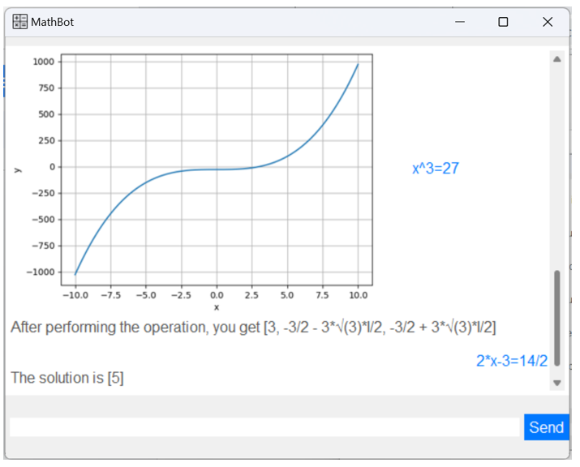

# Project Understanding
AI-powered Mathematics Assistant with voice features and graph generation capabilities

# Testing the application 
You can enter these messages to get started with MathBot

## Basic Greetings

## Mathematical Theoretical Questions

## Basic Mathematical Computations

## Graphing Feature

## Variable Solving

## Integration and Differentiation

